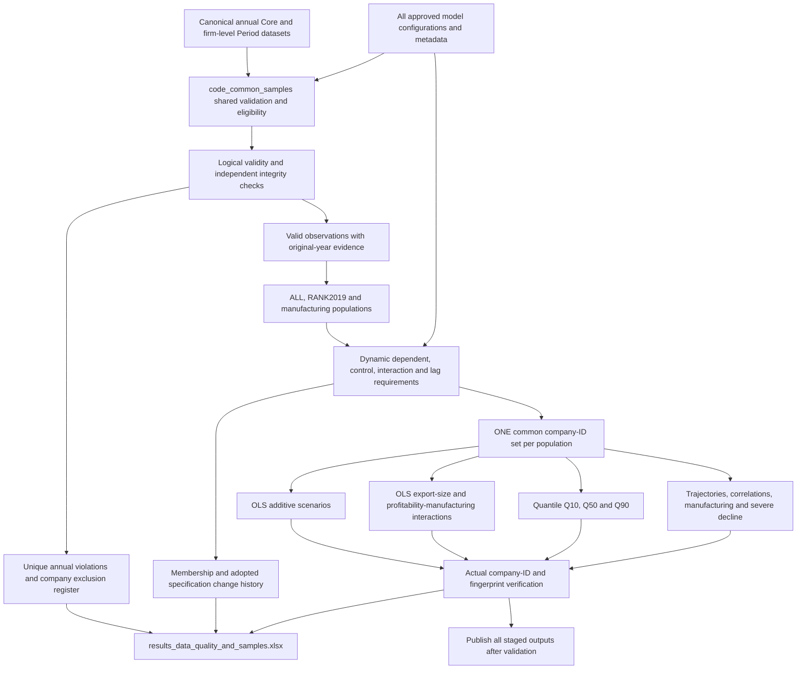

# GRIP quantitative workflow

## Purpose and scope

One shared validation and sample process serves additive OLS, the two existing interaction specifications, quantile regression, correlations, trajectories, manufacturing diagnostics, and severe P1 decline. One company-ID set is used within each population across all applicable periods and methods. Different populations remain distinct. Manufacturing populations are nested in their parent populations.

The canonical Core and Period datasets are read only. The 2018 extension supplies sales for the P1 lag; it supplies no required employment, exports, profitability or asset observations. Outcomes remain nominal/real annualised log sales growth under the shared growth-mode setting. P1 is 2019–2020, P2 2020–2022, P3 2022–2024 and FULL 2019–2024. FULL uses 2019 controls and has no lag.

## Source and configuration ownership

`code_build_core.py` and `code_build_period.py` remain the source of truth for canonical variables. `code_config.py` owns shared periods, regressors, lags, ownership, sector controls, active interaction metadata, winsor thresholds and manual firm exclusions. `code_ols_interactions.specification_config` owns the separate profitability × manufacturing specification. `code_quantile.CONFIG` owns quantiles and optimisation settings. `code_severe_p1_decline.CONFIG` owns severe thresholds and the logistic estimator.

`code_common_samples.approved_specifications()` reads these definitions rather than maintaining lists of eligible companies in each runner. It includes the complete model grid, diagnostic specification, interaction constituents and severe-group P1 outcome requirements. Shared metadata is not changed by a runner.

## Validity and eligibility

The independent data-quality auditor is reused in memory. Existing missingness, accounting review, magnitude and time-series screens remain visible. SUSPICIOUS and EXTREME screens do not become automatic cleaning thresholds. Human review decisions remain informational unless a documented rule or the explicit manual configuration authorises exclusion.

Automatic rules apply only to required observations and documented constraints:

- Sales must be finite and positive for an outcome, lag, log or required sales-denominated covariate.
- Employment must be positive where labour productivity or a log requires it. Fractional FTEs remain valid. Zero employment is not a firm-wide exclusion when unused.
- Required sales/employment/asset denominators must be valid and positive; other denominators must be finite and nonzero. Negative equity is retained for equity-denominated variables where mathematically permitted.
- Export intensity must lie within the adopted inclusive interval **[0,1]**. No rounding grace or cap is introduced. This is an approved comparability/eligibility policy; it does not resolve the original reporting-boundary questions behind E&Y or other export observations.
- Documented binary indicators must be 0/1. Capital ratio, profitability, turnover, productivity and signed growth are not arbitrarily bounded to [0,1].
- Missing/non-numeric essential model values or underlying inputs cause relevant eligibility failure. Nothing is imputed as zero.
- Independent mathematical/definition failures on a required source or derived variable prevent its use. Unknown variable lineage stops the run instead of guessing an alternative.
- Existing manual NIP/exact-name exclusions remain firm-wide. Orlen remains absent upstream; absent companies are not invented in the company register.

Annual violations retain their original year. Blank years identify firm-wide/stable-descriptor issues or derived quantities spanning an interval; the required original years for interval-derived variables are listed in the model-requirements section. A problem with an unused annual field does not invalidate the firm as a whole. Canonical values are never replaced by corrected, clipped or winsorised values.

## Common samples

For each population, the central process intersects actual eligible NIP sets across every applicable specification and P1/P2/P3/FULL. The existing complete-trajectory requirement is retained. The manufacturing intersection is also restricted to the parent population's common sample. Population non-membership is a scope restriction, not a quality failure.

The approved manifest, `data_common_sample_registry.json`, stores specification signature, source SHA256 hashes, sorted company IDs, sample sizes and sorted-ID fingerprints. It is analytical metadata, not a replacement canonical financial dataset.

Membership alignment leaves covariate timing intact: controls still come from 2019, 2020 and 2022. Continuous interaction inputs are centred on the estimation sample under the existing procedure. Winsorisation clips only the outcome at the existing 1%/99% quantiles **after** common membership is established. Standardisation still uses the existing within-sample means and population SDs. The profitability interaction retains its constituent scaling and binary manufacturing indicator.

## Registers and counts

The company exclusion register has one row per excluded company and one status for each population. A company outside manufacturing or RANK2019 can remain included in ALL. Underlying observations appear separately once per NIP × original year × variable × violated rule, with aggregated specification/population impacts.

Sample-flow stages are mutually exclusive: population universe → firm-wide manual exclusions → required logical invalidity → incomplete trajectory → no eligible model → further common-intersection loss → final common sample. This ordering avoids summing overlapping reasons. A firm can have many recorded violations while contributing only once to its population flow. The count of logical invalidity includes firms already absent from previous regressions; it is not the number newly removed by Stage 2.

`02_SAMPLE_OVERLAP` preserves pre-intersection eligibility by family and period. `08_MODEL_ALIGNMENT` records actual estimator/diagnostic company-ID fingerprints. `09_SAMPLE_CHANGE_LOG` retains adoption history, company additions/removals, responsible variables/years and the initial comparison with the previous period-specific OLS samples. Initial adoption is explicitly distinguished from a previous approved common sample.

## Running and changing specifications

Use the project Python environment with pandas, a Parquet engine, statsmodels, scipy, lxml, XlsxWriter and openpyxl. The existing bundled Python lacks the required Parquet support, so the established project environment is used.

1. Evaluate a proposed authoritative configuration change with `python code_run_quantitative_pipeline.py --audit-only`. Read the proposed IDs, required variables and years in `results_sample_change_proposal.json`.
2. Review the new requirements and exclusion evidence. Exploratory runner overrides cannot silently become production specifications.
3. After researcher adoption, run `python code_run_quantitative_pipeline.py --adopt-specification`.
4. For unchanged approved configurations/data, run `python code_run_quantitative_pipeline.py`. Use `--quality-only` to refresh consolidated evidence while preserving every regression workbook.

The central process automatically reassesses requirements when regressors, transformations, active interactions, quantiles, estimator settings, source versions or actual membership change. Unapproved changes stop standalone production runners before estimation. A missing lineage definition stops the run. Adding a ratio already covered by existing requirements may change the specification signature without changing IDs; this reassessment is still recorded.

All outputs are generated in a temporary staging directory. Missing fits, ID mismatches, invalid common-sample inputs or source changes prevent publication. Quantile convergence warnings are reported explicitly; they never authorise dropping companies or substituting a sample. Only after validation are production files replaced together, with rollback on replacement failure and recoverable snapshots. An interruption during a multi-file filesystem transaction is not a database transaction; recover from the archived snapshots if needed.

## Routine outputs

| Output | Purpose |
|---|---|
| `results_data_quality_and_samples.xlsx` | Central workflow, unique exclusions, annual findings, membership, rules, quality statistics, alignment and changes |
| `results_ols_scenarios.xlsx` | Additive OLS; all existing raw/standardised, baseline/winsor variants |
| `results_ols_interactions.xlsx` | Existing compact export × size and profitability × manufacturing models and comparisons |
| `results_quantile.xlsx` | Existing Q10/Q50/Q90 winsor-standardised quantile analysis |
| `results_diagnostics_trajectories.xlsx` | Correlations, regression descriptives and trajectories of the declared common samples |
| `results_severe_p1_decline_analysis.xlsx` | Existing additive Firth/logistic and P2/P3 group analyses on the corresponding ranking common samples |
| `results_data_quality_and_samples_metadata.json` | Source/output hashes, rules, coverage, screening references and requirement provenance |

The two superseded audit workbooks and their supporting run records are archived after validated consolidation. Their computation helpers remain available for independent checks; routine audit entry points route to the consolidated framework. No separate CORE_COMMON/EXTENDED samples are created. Broader trajectory descriptions are not currently generated as a second population; archived broad-universe workbooks remain labelled historical research records.

Analytical workbooks retain essential model/sample metadata and statistical diagnostics, but no repeated company exclusion lists. Primary `Dropped_Rows_Long` and duplicate diagnostic missingness output are removed. Detailed exclusions and missingness now live in the central workbook.

## Reproducibility and validation

`code_check_common_samples.py` validates source uniqueness, invalid/missing prerequisites, population nesting, actual IDs, fingerprints, saved model Ns and consolidated registers. Matched-sample regression checks compare against the preserved pre-refactoring engine: identical transformed outcomes/designs and identical coefficients, standard errors and p-values demonstrate that numerical changes relative to historical workbooks come from membership and its existing sample-dependent transformations.

`code_check_common_sample_policy.py` tests invalid exports/denominators, expected 2018 unavailability, preservation of extreme unbounded ratios, dynamic new requirements, unapproved overrides, and unchanged source frames. Existing mathematical/interaction/severe/audit tests remain relevant; historical migration comparisons must use the same company sample or explicitly remain historical, rather than demanding unchanged coefficients after approved exclusions.

Changing the approved requirements regenerates all affected families. Updating documentation and the workflow overview is part of any later structural change.

## Researcher review still required

Export boundaries behind ratios above 100% remain unresolved source questions even though the agreed eligibility bound is now applied. Very small exceedances may reflect source rounding; no grace interval is invented. Reporting-unit changes and consolidated/unconsolidated comparisons remain review findings except for explicitly documented firm-wide manual exclusions. Missing source ownership continues the existing builder mapping to Domestic and is flagged for review; this refactor does not invent a different ownership definition or exclusion.

Common membership is a comparability policy, not a remedy for selection: requiring later outcomes and controls conditions earlier-period analyses on later data availability. The original complete-trajectory selection already imposed part of this restriction. Interpret resilience/growth findings in that selected population and assess sensitivity before broader causal or population claims.
