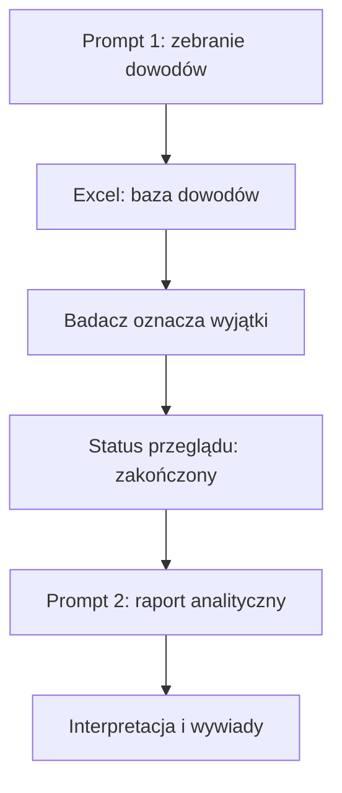

# GRIP Qualitative — workflow i rejestr decyzji

## 1. Cel projektu

Projekt wspiera wielokrotne studium przypadku firm poprzez systematyczne zebranie danych zastanych, ich przegląd przez badacza oraz przygotowanie raportu analitycznego. Materiał zewnętrzny ma uzupełniać i ukierunkowywać wywiady oraz umożliwiać triangulację z analizą ilościową. Nie zastępuje danych wewnętrznych ani interpretacji badacza.

## 2. Uzgodniony proces

Prompt 1 i Prompt 2 są rozdzielone obowiązkową interakcją z badaczem. Prompt 2 nie może uruchamiać się automatycznie po utworzeniu bazy.

## 3. Role i odpowiedzialność

### AI — etap bazy dowodów

- identyfikuje właściwy podmiot;
- wyszukuje i rejestruje źródła;
- rozdziela materiał na pojedyncze twierdzenia;
- koduje okres, obszar, charakter źródła i siłę dowodu;
- ujawnia konflikty, ograniczenia i braki;
- proponuje sposób wykorzystania informacji;
- generuje pytania do wywiadu;
- pozostawia pola decyzji badacza puste;
- nie oznacza przeglądu jako zakończonego.

### Badacz — etap przeglądu

- przegląda całą bazę;
- poprawia treść lub kodowanie, jeżeli jest to potrzebne;
- oznacza wyłącznie wyjątki;
- potwierdza zakończenie przeglądu na poziomie całego skoroszytu;
- odpowiada za ostateczny zakres materiału przekazanego do raportu.

### AI — etap raportu

- sprawdza bramkę zakończenia przeglądu;
- stosuje wyłącznie zaakceptowane wiersze;
- oddziela fakty, narracje i interpretacje;
- wskazuje sprzeczności, luki i alternatywne wyjaśnienia;
- zachowuje odwołania do ID informacji;
- nie prowadzi nowego wyszukiwania bez odrębnej decyzji badacza.

## 4. Reguła akceptacji przez wyjątki

W bazie dowodów znajduje się pole `wyjatek_badacza` z dozwolonymi wartościami:

- puste;
- `odrzuć`;
- `popraw`;
- `zweryfikuj`.

Znaczenie pustego pola zależy od statusu całego przeglądu:

| Status przeglądu | Znaczenie pustego `wyjatek_badacza` |
|---|---|
| `nierozpoczęty` | brak decyzji |
| `w toku` | jeszcze nie jest akceptacją |
| `zakończony` | wiersz zaakceptowany do raportu |

Po zakończeniu przeglądu Prompt 2 wykorzystuje wszystkie wiersze bez wyjątku. Wiersze `odrzuć`, `popraw` i `zweryfikuj` są wyłączone. Po rozwiązaniu korekty lub weryfikacji badacz usuwa oznaczenie wyjątku; samo AI nie usuwa go na podstawie własnej oceny.

## 5. Status przeglądu

Pole `status_przegladu_badacza` znajduje się w arkuszu metadanych i przyjmuje wartości:

- `nierozpoczęty`;
- `w toku`;
- `zakończony`.

Nowy skoroszyt zawsze otrzymuje status `nierozpoczęty`. Tylko badacz może ustawić `zakończony`. Brak wyjątków w wierszach nie jest wystarczającym dowodem zakończenia przeglądu.

## 6. Struktura plików

- `00_GRIP_Qualitative_Workflow.md` — trwały opis procesu, decyzji i zmian;
- `Prompt_1_Baza_dowodow.md` — instrukcja tworzenia bazy dowodów;
- `Prompt_2_Raport_analityczny.md` — instrukcja tworzenia raportu po przeglądzie;
- plik Excel dla każdej firmy — baza dowodów i instrument przeglądu;
- osobny dokument raportu — wynik Promptu 2.

Wyniki tworzone przez prompty zapisuje się bezpośrednio w folderze `Outputs/`. Nie tworzy się podfolderów dla pojedynczej firmy i nie zostawia w `Outputs/` plików pomocniczych, podglądów, logów, kopii roboczych ani wariantów roboczych.

Obowiązujące nazwy plików:

- `[Nazwa_firmy_bez_formy_prawnej]_Baza_dowodow.xlsx`;
- `[Nazwa_firmy_bez_formy_prawnej]_Raport_analityczny.docx`;
- `[Nazwa_firmy_bez_formy_prawnej]_Notatki_badacza.md` — tylko jeżeli badacz wyraźnie poprosi o dodatkowe notatki.

Przykłady dla pilotażu: `Phillips_Europe_Baza_dowodow.xlsx` i `Phillips_Europe_Raport_analityczny.docx`.

## 7. Zasady metodologiczne

1. Jednostką analizy jest jednoznacznie zidentyfikowany podmiot prawny, nie cała grupa, chyba że informacja o grupie została wyraźnie oznaczona jako kontekst.
2. Jeden wiersz bazy odpowiada jednemu niezależnemu twierdzeniu lub obserwacji.
3. Potwierdzenie treści źródła nie jest tym samym co niezależne potwierdzenie twierdzenia.
4. Powielenie komunikatu firmy przez inne portale nie tworzy wielu niezależnych dowodów.
5. Narracja oficjalna, menedżerska, zewnętrzna i pracownicza pozostają rozróżnione.
6. Data publikacji i data zdarzenia są kodowane osobno.
7. Kontekst wyjściowy opisuje sytuację na wejściu w 2019 rok; P1 obejmuje lata 2019–2020.
8. Materiał od 2025 roku nie jest P3, lecz materiałem późniejszym.
9. Brak danych nie oznacza braku zjawiska.
10. Raport nie stosuje języka przyczynowego bez odpowiedniej podstawy dowodowej.
11. Prompt 1 ma wymuszać systematyczną kwerendę po rodzinach źródeł, a nie tylko zapis przypadkowo odnalezionych materiałów.
12. Raporty lub notatki porównawcze innych osób mogą służyć jako inspiracja do ulepszania protokołu wyszukiwania, ale ich twierdzenia nie są kopiowane do bazy bez przejścia przez Prompt 1.

## 8. Kontrola jakości

Przed przekazaniem bazy do badacza należy sprawdzić:

- poprawność identyfikacji podmiotu;
- kompletność i kolejność kolumn;
- zgodność liczby pól w każdym wierszu;
- unikalność ID;
- poprawność wartości kontrolowanych;
- puste pola przeznaczone dla decyzji badacza;
- zgodność pytań do wywiadu z wierszami źródłowymi;
- brak przesunięć wartości między kolumnami;
- działanie filtrów, formuł i walidacji;
- czy każdy arkusz ma zamrożony pierwszy wiersz i pierwszą kolumnę;
- czy każdy arkusz ma widoczny, pogrubiony i kontrastowy wiersz tytułowy;
- status przeglądu `nierozpoczęty`.

Przed uruchomieniem raportu należy sprawdzić:

- status przeglądu `zakończony`;
- brak niedozwolonych wartości wyjątków;
- liczbę wierszy przyjętych i wykluczonych;
- zachowanie identyfikatorów użytych w cytowaniach raportu;
- czy skróty branżowe, finansowe, systemowe i rejestrowe są rozwinięte przy pierwszym użyciu albo wyjaśnione w słowniku skrótów.

## 9. Pilotaż — Phillips Europe Sp. z o.o.

### Wykonane

- przygotowano pierwszą wersję Promptu 1;
- przeprowadzono wyszukiwanie dla Phillips Europe Sp. z o.o., KRS 0000654066, NIP 7010644754, REGON 366145172;
- utworzono bazę dowodów w Excelu;
- zidentyfikowano 45 wierszy dowodowych i 14 przejrzanych źródeł;
- ujawniono nierówną dostępność materiału: relatywnie lepszą dla finansów i umiędzynarodowienia, słabszą dla reakcji na COVID-19, procesów decyzyjnych i kultury wewnętrznej.

### Zidentyfikowane problemy

- pierwotny Prompt 1 zawierał propozycję decyzji w każdym wierszu, a Prompt 2 wymagał osobnej jawnej akceptacji;
- brakowało bramki potwierdzającej zakończenie przeglądu całej bazy;
- w wierszu `PE-001` nastąpiło przesunięcie wartości między kolumnami, co spowodowało także błędne pytanie w arkuszu pytań;
- część danych finansowych pochodziła z agregatora bez bezpośredniego uzgodnienia z dokumentami RDF, dlatego wymaga weryfikacji przed wykorzystaniem jako dane formalne.

### Decyzja dotycząca istniejącej bazy

Nie trzeba powtarzać całego wyszukiwania. Istniejący skoroszyt należy najpierw dostosować do nowej struktury, naprawić przesunięty wiersz, dodać pola wyjątków i status przeglądu oraz pozostawić nierozwiązane dane finansowe jako wymagające weryfikacji.

Prompt 2 może zostać przetestowany dopiero po przeglądzie badacza i ustawieniu statusu `zakończony`.

### Migracja wykonana 2026-08-03

- zmieniono arkusz `00_README` na `00_METADANE`;
- dodano `status_przegladu_badacza = nierozpoczęty` oraz pola `badacz`, `data_zakonczenia_przegladu` i `uwagi_do_przegladu`;
- dostosowano `02_BAZA_DOWODOW` do 31 kolumn aktualnego Promptu 1;
- przeniesiono dawne statusy badacza do `propozycja_ai`, pozostawiając `wyjatek_badacza` i `komentarz_badacza` puste;
- naprawiono wiersz `PE-001` oraz odpowiadające mu pytanie w arkuszu `06_PYTANIA`;
- pozostawiono dane finansowe z BizRaport jako wymagające weryfikacji z dokumentami RDF.

### Prompt 2 wykonany 2026-08-03

Prompt 2 uruchomiono dopiero po stwierdzeniu w skoroszycie `status_przegladu_badacza = zakończony`. Wszystkie 45 wierszy miało puste `wyjatek_badacza`, dlatego zostały przyjęte do raportu zgodnie z regułą akceptacji przez wyjątki. Raport zapisano jako `Phillips_Europe_Raport_analityczny.md`.

### Porównanie z raportem zewnętrznym 2026-08-03

Porównanie z raportem przygotowanym przez inną osobę pokazało, że obecny Prompt 1 dobrze wymusza strukturę, kodowanie i audytowalność, ale zbyt słabo wymusza szeroką kwerendę źródłową. W odpowiedzi rozszerzono Prompt 1 o protokół wyszukiwania według rodzin źródeł: formalnych, finansowych, branżowych, osobowych, rekrutacyjnych, pracowniczych, społecznościowych i negatywnych. Celem jest tworzenie bogatszej bazy dowodów bez kopiowania cudzych twierdzeń i bez utraty kontroli metodologicznej.

### Robust Prompt 1 wykonany 2026-08-03

Po rozszerzeniu protokołu wyszukiwania ponownie uruchomiono Prompt 1 dla Phillips Europe jako osobny, porównywalny przebieg. Nie uruchamiano Promptu 2. Nowy skoroszyt zapisano jako `Outputs/Phillips_Europe_Baza_dowodow.xlsx`.

Zakres nowej bazy:

- 87 wierszy dowodowych;
- 28 źródeł w rejestrze, w tym źródła rejestrowe, agregatory finansowe, portale branżowe, profile zarządcze, strony certyfikatów, źródła CSR/employer branding, GoWork, LinkedIn oraz kwerenda negatywna;
- 57 wierszy w arkuszu niezweryfikowanych, sprzecznych lub wymagających dalszej kontroli;
- 5 konfliktów i 14 braków badawczych;
- status `status_przegladu_badacza = nierozpoczęty`.

Wnioski dla kolejnej iteracji: Prompt 1 działa lepiej jako generator bogatej bazy dowodowej, ale dla danych finansowych nadal potrzebny jest osobny krok pobrania i odczytu dokumentów RDF. Materiały aktualne z lat 2025-2026 należy konsekwentnie traktować jako `MATERIAŁ PÓŹNIEJSZY`, chyba że dokumentują wcześniejsze zdarzenie.

### Prompt 2 na bazie robust wykonany 2026-08-04

Na jawne polecenie badacza uruchomiono Prompt 2 dla robust bazy Phillips Europe. Status przeglądu w `Outputs/Phillips_Europe_Baza_dowodow.xlsx` ustawiono na `zakończony`, z adnotacją, że wynika to z polecenia badacza. Raport zapisano jako `Outputs/Phillips_Europe_Raport_analityczny.docx`.

Zestawienie kontrolne przebiegu:

- 87 wierszy w bazie;
- 87 wierszy przyjętych;
- 0 wierszy wykluczonych przez `odrzuć`, `popraw` lub `zweryfikuj`;
- raport nie prowadził dodatkowego wyszukiwania i używał wierszy niezweryfikowanych, sprzecznych oraz braków danych wyłącznie jako ostrzeżeń, luk lub hipotez roboczych.

### Druga lekcja z benchmarku 2026-08-04

Ponowne porównanie z raportem benchmarkowym pokazało, że nasz raport jest mocniejszy strukturalnie i metodologicznie, ale benchmark nadal lepiej działał jako radar źródeł. Szczególnie wartościowe były tropy: kowenanty i finansowe czerwone flagi, konkretni klienci i kanały sprzedaży, udział eksportu i liczba rynków, oferty pracy ujawniające CAD/CAM i B+R, profile osobowe oraz pełniejsza lista źródeł z wynikami negatywnymi.

W odpowiedzi wzmocniono Prompt 1 jako zewnętrzny silnik dowodowy:

- wprowadzono cztery fazy kwerendy: identyfikacja, rodziny źródeł, kwerenda po tropach i audyt zamknięcia;
- rozszerzono `01_REJESTR_ZRODEL` z bibliografii do rejestru ścieżek wyszukiwania, tropów, wyników i ograniczeń;
- dodano obowiązkowe wyszukiwanie czerwonych flag finansowych, klientów, kanałów, regionów, ofert pracy, systemów, produktów, osób i źródeł negatywnych;
- dodano audyt domknięcia kwerendy w `07_KONTROLA_JAKOSCI`;
- doprecyzowano, że agregatory finansowe nie tworzą danych formalnych bez dokumentu pierwotnego.

### Test obu promptów po wzmocnieniu silnika dowodowego 2026-08-04

Na jawne polecenie badacza uruchomiono oba prompty w bieżącej wersji dla Phillips Europe. Prompt 1 utworzył zaktualizowany skoroszyt `Outputs/Phillips_Europe_Baza_dowodow.xlsx`, a Prompt 2 utworzył raport `Outputs/Phillips_Europe_Raport_analityczny.docx`.

Zestawienie kontrolne przebiegu:

- 112 wierszy dowodowych;
- 41 źródeł lub ścieżek kwerendy w `01_REJESTR_ZRODEL`;
- 65 wierszy w arkuszu niezweryfikowanych, sprzecznych lub wymagających dalszej kontroli;
- 7 konfliktów;
- 18 braków badawczych;
- 112 wierszy przyjętych do testowego raportu po ustawieniu statusu przeglądu na `zakończony` zgodnie z poleceniem badacza;
- 0 wierszy wykluczonych przez `odrzuć`, `popraw` lub `zweryfikuj`.

Wnioski z testu: wzmocniony Prompt 1 lepiej wychwytuje zewnętrzne tropy benchmarkowe bez kopiowania raportu zewnętrznego. Szczególnie poprawiły się: eksport i rynki, klienci i kanały OEM/OE/aftermarket, profile przywódcze, oferty pracy jako ślad systemów i kompetencji oraz rejestr wyników negatywnych. Nadal największym ograniczeniem pozostaje brak pierwotnych dokumentów z Repozytorium Dokumentów Finansowych KRS, zwłaszcza dla strat, kowenantów, kredytów, leasingu, kontynuacji działalności i cen transferowych.

Korekta Promptu 2 po renderowaniu: macierz podsumowująca musi być krótka i czytelna w Wordzie. Szczegóły mają trafiać do sekcji opisowych, a komórki macierzy powinny zawierać tylko syntezę.

### Pętla benchmarkowa — dramatyczna przewaga procedury 2026-08-04

Zdefiniowano roboczo, że procedura dramatycznie przebija benchmark dopiero wtedy, gdy:

- `01_REJESTR_ZRODEL` ma co najmniej 2 razy więcej pozycji niż liczba URL w benchmarku albo zawiera wszystkie źródła benchmarku plus co najmniej 10 dodatkowych istotnie różnych ścieżek;
- każdy URL z benchmarku ma status backtestu;
- baza ma więcej audytowalnych twierdzeń niż benchmark;
- każdy z siedmiu obszarów ma dodatnie dowody albo jawny brak danych;
- finansowe czerwone flagi, klienci/kanały/eksport, osoby, oferty pracy/systemy i źródła negatywne są sprawdzone osobno;
- raport Word zawiera ścieżkę audytową i kompaktowy załącznik źródłowy.

Po pętli 2 warunek został spełniony dla Phillips Europe:

- benchmark zawierał 31 adresów URL;
- nasza baza zawiera 67 pozycji w `01_REJESTR_ZRODEL`, czyli ponad 2 razy więcej niż benchmark;
- 0 URL benchmarku pozostaje bez dokładnego statusu w rejestrze;
- baza zawiera 131 wierszy dowodowych;
- raport Word zawiera 84 przywołane ID dowodowe i sekcję `Załącznik źródłowy`;
- arkusze Excel zachowują filtry, zamrożenie pierwszego wiersza i pierwszej kolumny oraz kontrastowe nagłówki.

Ważna zasada metodologiczna z pętli: benchmarkowe źródło bez dostępu lub bez transkrypcji nie jest faktem. Dostaje status `brak dostępu`, `niepotwierdzony`, `E. NIEZWERYFIKOWANE` albo `G. BRAK DANYCH` i generuje pytanie do dalszej weryfikacji.

### Niezależny Prompt 1 po odłożeniu benchmarku 2026-08-04

Na polecenie badacza odłożono raport benchmarkowy i ponownie przygotowano `Outputs/Phillips_Europe_Baza_dowodow.xlsx` jako niezależny przebieg Promptu 1. Benchmark ani raport porównawczy nie były użyte jako źródło, checklista ani trop.

Wynik niezależnego Promptu 1:

- 112 wierszy dowodowych;
- 42 źródła lub ścieżki kwerendy;
- 63 wiersze niezweryfikowane, sprzeczne albo wymagające dalszej kontroli;
- 7 konfliktów;
- 17 braków badawczych;
- status `status_przegladu_badacza = nierozpoczęty`;
- w skoroszycie nie ma sformułowania `benchmark` ani twierdzenia o potencjalnym naruszeniu kowenantów z raportu porównawczego;
- czerwone flagi finansowe pozostają niezależną luką RDF: bez dokumentów RDF nie można ocenić kredytów, leasingu, kowenantów, zdarzeń po dniu bilansowym ani kontynuacji działalności.

W tym momencie nie uruchomiono jeszcze Promptu 2. Istniejący wtedy plik Word w `Outputs/` pochodził z wcześniejszego przebiegu benchmark-audited i nie był raportem niezależnym.

### Niezależny Prompt 2 wykonany 2026-08-04

Na jawne polecenie badacza uruchomiono Prompt 2 z niezależnej bazy Promptu 1. Status przeglądu w `Outputs/Phillips_Europe_Baza_dowodow.xlsx` ustawiono na `zakończony` z adnotacją, że wynika to z polecenia badacza.

Zestawienie kontrolne:

- 112 wierszy dowodowych;
- 42 źródła lub ścieżki kwerendy;
- 112 wierszy przyjętych do raportu;
- 0 wierszy wykluczonych przez `odrzuć`, `popraw` lub `zweryfikuj`;
- raport zapisano jako `Outputs/Phillips_Europe_Raport_analityczny.docx`;
- raport Word nie zawiera warstwy benchmarkowej ani odwołań do nieistniejących ID;
- DOCX został wyrenderowany i przeszedł wizualną kontrolę układu.

## 10. Rejestr decyzji i zmian

| Data | Decyzja lub zmiana | Uzasadnienie |
|---|---|---|
| 2026-07-01 | Rozdzielono bazę dowodów i końcowy raport na dwa dokumenty | Ułatwia audyt źródeł i zapobiega przedwczesnej syntezie |
| 2026-07-01 | Wprowadzono obowiązkową interakcję z badaczem między Promptem 1 i 2 | Raport nie powinien automatycznie dziedziczyć błędów i niezweryfikowanych twierdzeń |
| 2026-08-03 | Przyjęto akceptację przez wyjątki | Badacz oznacza tylko odrzucenia, korekty i weryfikacje zamiast zatwierdzać każdy wiersz |
| 2026-08-03 | Dodano bramkę `status_przegladu_badacza` | Puste pola można uznać za akceptację dopiero po potwierdzeniu pełnego przeglądu |
| 2026-08-03 | Skorygowano Prompty 1 i 2 | Ujednolicono pola, zasady wyboru i kontrole strukturalne po pilotażu Phillips Europe |
| 2026-08-03 | Zmigrowano bazę Phillips Europe do aktualnej struktury Promptu 1 | Usunięto przesunięcie `PE-001`, dodano pola wyjątków i utrzymano blokadę Promptu 2 do czasu przeglądu badacza |
| 2026-08-03 | Doprecyzowano zasady migracji starszych baz w Prompcie 1 i bramkę strukturalną w Prompcie 2 | Dokumentacja ma pozostawać żywa i odzwierciedlać problemy ujawnione podczas pracy na pilotażu |
| 2026-08-03 | Uruchomiono Prompt 2 dla Phillips Europe po zakończeniu przeglądu | Raport wykorzystuje 45 zaakceptowanych wierszy i nie prowadzi dodatkowego wyszukiwania |
| 2026-08-03 | Rozszerzono Prompt 1 o protokół robust source search | Porównanie z raportem zewnętrznym ujawniło potrzebę systematycznego sprawdzania źródeł osobowych, branżowych, rekrutacyjnych, społecznościowych i negatywnych |
| 2026-08-03 | Ponownie uruchomiono Prompt 1 dla Phillips Europe w wersji robust | Utworzono osobny skoroszyt z 87 wierszami i statusem `nierozpoczęty`; Prompt 2 pozostaje zablokowany do czasu przeglądu badacza |
| 2026-08-04 | Uproszczono nazewnictwo i strukturę folderu wynikowego | Pliki wynikowe mają trafiać bezpośrednio do `Outputs/` pod nazwami `[Firma]_Baza_dowodow.xlsx` i `[Firma]_Raport_analityczny.docx`, bez podfolderów i artefaktów pomocniczych |
| 2026-08-04 | Uruchomiono Prompt 2 na robust bazie Phillips Europe | Badacz jawnie polecił uruchomienie Promptu 2; raport zapisano w Word jako `Outputs/Phillips_Europe_Raport_analityczny.docx` |
| 2026-08-04 | Dodano reguły czytelności skrótów i formatowania skoroszytu | Raport ma rozwijać skróty lub zawierać słownik, a baza Excel ma mieć kontrastowe nagłówki, filtry oraz zamrożony pierwszy wiersz i pierwszą kolumnę |
| 2026-08-04 | Wzmocniono Prompt 1 jako silnik zewnętrznych dowodów | Dodano kwerendę po tropach, czerwone flagi finansowe, szczegółowe źródła klientów/ofert pracy/osób/systemów oraz audyt domknięcia kwerendy |
| 2026-08-04 | Przetestowano oba prompty po wzmocnieniu Promptu 1 | Nowy przebieg Phillips Europe zwiększył bazę do 112 wierszy i 41 ścieżek źródłowych, a Prompt 2 wygenerował zweryfikowany wizualnie raport Word |
| 2026-08-04 | Dokręcono regułę macierzy w Prompcie 2 | Bogatsza baza powodowała zbyt gęstą tabelę; macierz ma być syntetyczna, a szczegóły powinny pozostać w sekcjach opisowych |
| 2026-08-04 | Dodano backtest benchmarku i kryterium dramatycznej przewagi | Procedura musi nie tylko być lepiej napisana, ale też pokrywać lub jawnie klasyfikować każdy trop benchmarkowy |
| 2026-08-04 | Wykonano pętlę 2 benchmarku Phillips Europe | Baza wzrosła do 131 wierszy i 67 pozycji źródłowych, wszystkie 31 URL benchmarku mają status, a raport Word otrzymał załącznik źródłowy |
| 2026-08-04 | Uogólniono prefiksy ID dla kolejnych firm | `PE` pozostaje prefiksem pilota Phillips Europe; nowe firmy muszą otrzymać własny prefiks i nie mogą dziedziczyć danych ani skryptów pilota |
| 2026-08-04 | Ponownie uruchomiono Prompt 1 jako niezależne studium | Zastąpiono benchmark-audited bazę niezależnym skoroszytem 112 wierszy i statusem `nierozpoczęty`; Prompt 2 nie został uruchomiony w tym kroku |
| 2026-08-04 | Uruchomiono Prompt 2 z niezależnej bazy | Raport Word został odtworzony bez warstwy benchmarkowej na podstawie 112 zaakceptowanych wierszy i 42 źródeł/ścieżek |

## 11. Następne kroki

1. Przy kolejnym przebiegu Promptu 1 przetestować nowy audyt domknięcia kwerendy na Phillips Europe albo następnej firmie.
2. Zweryfikować dane finansowe z pierwotnymi dokumentami RDF przed użyciem jako dane formalne.
3. Po pilotażu dalej aktualizować prompty i workflow przed zastosowaniem do kolejnych firm.
